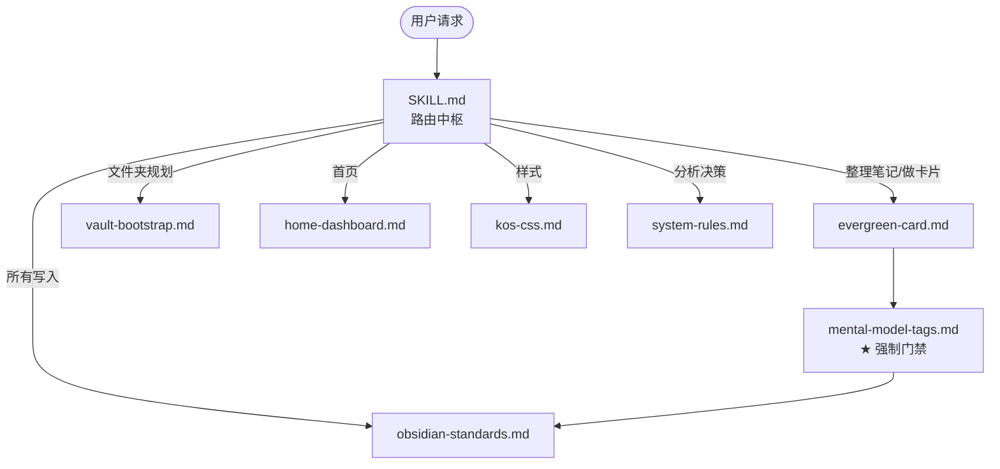

# Obsidian 笔记助手

把你的一次次「记录」沉淀成可导航、可积累、可复习的个人知识系统。从第一次打开空 Vault，到拥有文件夹、首页、常青卡片、标签和统一的视觉样式——这个 skill 陪你走完全程。

> 面向个人知识库的 Obsidian Hermes skill。只读优先、确认后写入；AI 提炼公共知识，你沉淀私人知识。

```
使用 $obsidian-skill，……
```

---

## 设计原则

| 原则 | 说明 |
| --- | --- |
| **只读优先** | 默认输出内容或预览，只有用户明确要求才落盘 |
| **确认后才改** | 建文件夹、写首页、更新 `kos.css`、覆盖同名文件，一律先给预览再执行 |
| **人机分工** | AI 提炼可验证的公共知识；你的理解、经历与迁移（第 7 节）永远由你填写 |
| **门禁兜底** | 常青卡片必须跑完心智模型打标子流程才能交付，防止凭关键词乱贴标签 |
| **对齐真实库** | 先扫描你已有的 Vault，再规划补缺；不套用一套脱离实际的通用模板 |

---

## 新手路线

从「打开一个空 Vault」到「拥有可导航、可积累、可复习的知识系统」。每一步都会告诉你：做什么、为什么、下一步是什么。

1. **先看清现状** — 确认 Vault 位置、已有笔记数、主题与插件，不把隐藏目录当知识内容。
2. **建立最小结构** — 先规划目录，不移动旧笔记；确认后才创建缺失目录。
3. **建立首页** — 若已有 `index.md`/`Dashboard.md` 等主页则**合并**；全空才新建。
4. **记录第一条笔记** — 从一个问题、一篇文章或一个想法开始，不追求一次完美分类。
5. **升级常青卡片** — 主题需要长期复用时使用七节模板，保留「内化」给你填写。
6. **连接与打标** — 只链接真实存在的笔记；常青卡片跑芒格心智模型打标。
7. **最后美化** — 结构稳定后再生成首页布局与 `kos.css`。

直接这样开始：

```
使用 $obsidian-skill，我是 Obsidian 新手，请先扫描我的 Vault，告诉我现状和最小可行的文件夹结构，只输出规划，不要创建。
```

---

## 能力总览

| 能力 | 你得到什么 | 默认落点 |
| --- | --- | --- |
| 七节常青笔记 | 可复习复用的知识卡片，第 7 节留给你内化 | `03-Resources/Evergreen/` |
| 芒格心智模型打标 | 从封闭学科表选出 1–5 个标签写入 `tags` | 原笔记 YAML |
| 文件夹规划 | 基于真实 Vault 的目录预览（扫描 → 确认 → 创建） | Vault 根目录 |
| 首页工作台 | 可导航的首页，优先合并已有主页 | `index.md` / `00-Home.md` |
| KOS 样式 | 统一的 `kos.css`，diff 预览后写入 | Vault 根目录 |
| 系统守则分析 | 按「健康 > 生活 > 价值」分析决策与困惑 | 对话输出 |

### 七节常青卡片

每张卡片只解释一个可独立命名的概念，固定七节：

```markdown
1. 问题  2. 概念  3. 关系  4. 案例  5. 行动  6. 边界  7. 内化
```

前六节由 AI 提炼可验证的公共知识；第 7 节「内化」AI 绝不代写，只有你能填写。

### 芒格多元思维模型打标

卡片完成后先分析底层机制，再从 15 个规范学科中选 1–5 个标签写入原有 `tags`：

```yaml
tags:
  - 心智模型/微观经济学
  - 心智模型/复杂系统与决策科学
```

不新增 `mental_models` 属性，也不按表面主题强行分类。

### 从 0 到 1 规划 Vault

先扫描真实 Vault，标注「已存在 / 建议新增 / 需要你决定」三类目录，再做补缺规划。**识别范围会随你的 Vault 而定**——通用参考树如下，`04/05` 仅在你已有同类职责才建议：

```text
00-Attachments/   附件与素材        （也可用 00-Growth / 00-Information / 00-LLM-WiKi 等多层数据）
01-Projects/      进行中的项目
02-Areas/         持续维护的领域
03-Resources/     可复用知识与资料
04-Archives/      已完成但需保留    （可选）
05-Agents/        技能与自动化       （可选）
```

有些仓库用 `10-健康 / 20-生活 / 30-价值` 这类支柱目录 + 实现目录混排——技能会优先保留你的现状，绝不主动迁移或重命名。

### 首页工作台

是导航层，不是正文仓库。只链接真实存在的文件夹或索引，不为了好看生成空文件；若 Vault 已有 `index.md`/`Dashboard.md`，则合并规划而非新造。

### KOS CSS

检查现有主题与 CSS snippets，生成或更新 `kos.css`。默认使用 Obsidian CSS 变量、低饱和强调色与 `.kos-*` 前缀；给出差异预览，不静默覆盖。

### 系统守则分析

遇到决策或困惑弹「分析 XX」时，按 `健康 > 生活 > 价值` 的优先级：定位 → 对照基本事实 → 耦合检查 → 给判断 → 追问。

```
使用 $obsidian-skill，分析我是否应该接这个新项目。
```

---

## 核心架构

`obsidian-skill` 是一个**单入口、分层引用**的 skill：`SKILL.md` 是唯一大脑，负责把所有请求路由到对应能力；`references/` 里是 7 个按需加载的既有模板与规范。校验器保证包的可发布质量。



**分层职责**

- **规范层（横切）**：`obsidian-standards.md`（命名 / YAML / 双链 / 安全更新）几乎是所有写入任务的必读；`system-rules.md` 服务于分析类任务。
- **模板层（按需）**：六种子任务各自的模板或工作流，命中路由表才加载。
- **门禁层（常青卡片专属）**：`mental-model-tags.md` — 卡片不跑完它的判断流程，输出与保存一律拒绝。

```
一次「把文章做成卡片」的完整生命周期：
  路由 → evergreen-card 七节 → 查重 → AI 填前六节
  → [门禁] mental-model-tags → 1-5 标签 → 写入 tags
  → 第 7 节留空 → obsidian-standards 复核 → 交付
```

### 用户体验

- **公共 vs 私人**：第 7 节永远留给用户 —— 这是 skill 最重要的红线。
- **可撤销**：任何结构性变更（目录 / 首页 / CSS）都先预览、后执行、不静默覆盖。
- **可校验**：每次改动跑 `tools/validate_skill.py .`，保证不破坏包结构。

---

## 安全边界

- 默认只输出或预览；用户明确要求保存才写文件。
- 同名文件存在时不静默覆盖，先展示差异。
- 不删除、移动、批量重命名或合并已有笔记。
- 双链只指向真实存在或用户明确计划创建的目标。
- 不把 `.obsidian/`、`.git/`、`.trash/`、缓存与凭据当作知识内容。
- 更新 `kos.css` 时不改写第三方主题文件，不删除已有规则。

---

## 默认约定

- 文件名 = 核心词，不添加日期、序号或冗余后缀；正文不重复与文件名相同的一级标题。
- YAML 沿用知识库既有字段：`name` / `description` / `category` / `tags` / `source` / `status`。
- 首页默认写入 Vault 根目录；已有 `index.md` / `Dashboard.md` 时先合并规划。

---

## 包结构

```text
obsidian-skill/
├── SKILL.md                 # 入口 & 路由中枢
├── README.md                # 本文件
├── agents/openai.yaml       # 外部接口元数据
├── tools/validate_skill.py  # 包质量校验器
├── .github/                 # CI 门禁
└── references/              # 按需加载的模板与规范
    ├── evergreen-card.md     # 七节常青卡片
    ├── mental-model-tags.md  # ★ 芒格标签门禁
    ├── obsidian-standards.md # 写入规范
    ├── vault-bootstrap.md    # 目录从 0 到 1
    ├── home-dashboard.md     # 首页工作台
    ├── kos-css.md            # CSS 样式
    └── system-rules.md       # 分析协议
```

---

## 校验

在技能目录执行：

```bash
python3 tools/validate_skill.py .
```

校验器会检查 `SKILL.md` 的 frontmatter、相对链接完整性以及 `agents/` 接口段。CI（`.github/workflows/validate.yml`）在每次 push/PR 时自动执行同一命令。